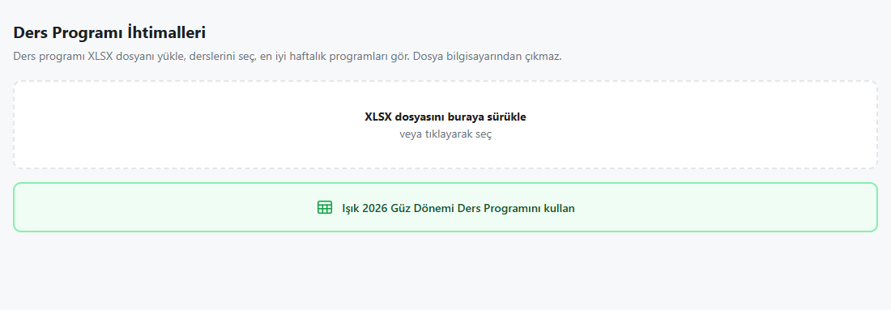
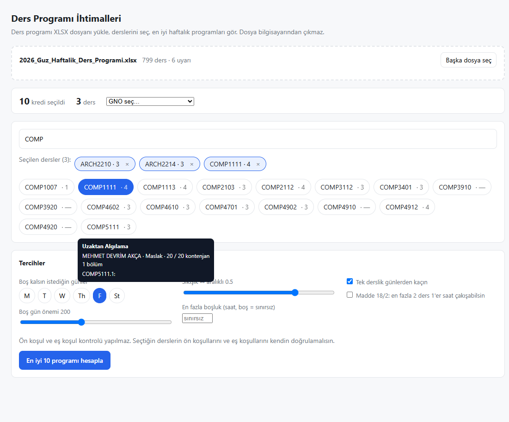
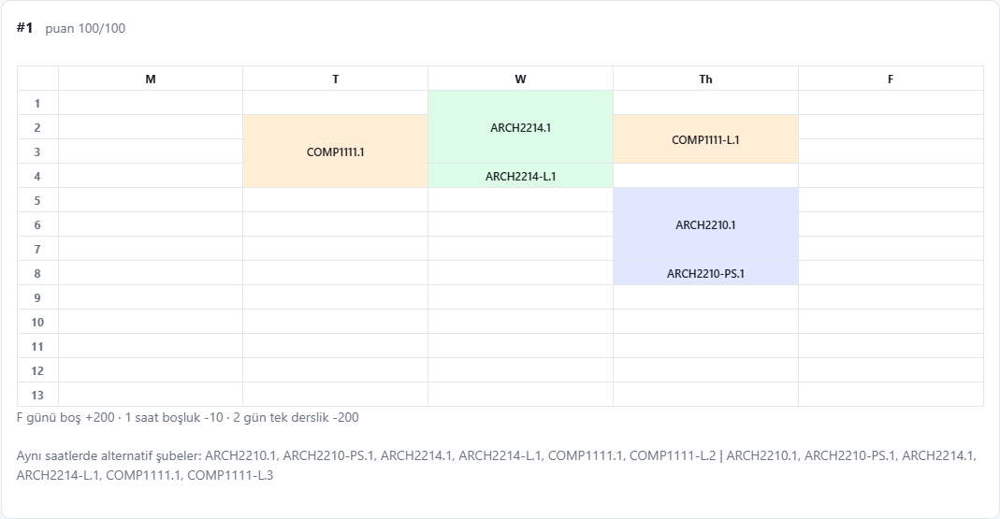
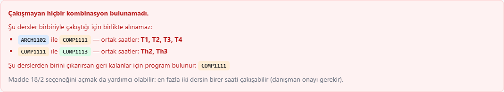

# Üniversite Ders Planlayıcı

Ders programı XLSX dosyanı yükle, derslerini seç, haftalık programının **en iyi 10 ihtimalini** gör.


[Live DEMO](https://planner.alpdurak.com.tr/)

Kurulum yok, sunucu yok, derleme adımı yok. `index.html` dosyasına çift tıkla, yeter.
**Dosyan bilgisayarından hiç çıkmaz** — her şey tarayıcının içinde çalışır.

<p align="center">
  
</p>

---

## Ne yapar?

<table>
<tr>
<td width="50%" valign="top">

**Dersleri seç**

Ders kodu, ders adı veya öğretim üyesine göre ara. Arama Türkçe karakterlere
duyarsızdır: `isi` yazınca `İSİ` de bulunur.

Etiketlerde sadece ders kodu ve kredisi görünür; üzerine gelince tam ad,
öğretim üyesi, kampüs, saatler ve kontenjan çıkar.

Toplam kredi **ders başına bir kez** sayılır — laboratuvar ve problem seansı
krediyi ikinci kez eklemez.

</td>
<td width="50%" valign="top">



</td>
</tr>
</table>

**Haftalık programları gör**

Seçtiğin derslerin çakışmayan bütün yerleşimleri arasından tercihlerine en uygun
10 tanesi sıralanır. Her dersin rengi bütün programlarda aynı kalır, ardışık
saatler tek blokta birleşir ve puanın nereden geldiği açıkça yazar.

<p align="center">
  
</p>

**Çakışma varsa nedenini söyler**

"Program bulunamadı" demek yetmez. Hangi derslerin birbiriyle çakıştığını, tam
olarak hangi saatlerde çakıştığını ve hangi dersi çıkarırsan sorunun çözüleceğini
gösterir.

<p align="center">
  
</p>

---

## Başlarken

**Yol 1 — hazır program:** `index.html` dosyasını aç, yeşil
**"Işık 2026 Güz Dönemi Ders Programını kullan"** butonuna tıkla. Hepsi bu.

**Yol 2 — kendi dosyan:** Kendi XLSX dosyanı sürükle ya da tıklayıp seç.

Dosyanın sütun başlıkları yanlış olsa bile sorun değil: sütunlar başlık
yazılarına değil, **içeriğin biçimine** bakılarak tanınır.

## Tercihler

| Tercih | Ne yapar |
|---|---|
| **Boş günler** | Seçtiğin günlerin boş kalmasını ödüllendirir, ağırlığını sen ayarlarsın |
| **Sıkışık ↔ aralıklı** | Dersleri sıkıştırmak mı, aralarında boşluk bırakmak mı istediğini belirler |
| **En fazla boşluk** | Belirlediğinden uzun boşluğu olan programları tamamen eler |
| **Tek derslik günler** | Sırf tek ders için okula gitmeyi cezalandırır |
| **Madde 18/2** | Yönetmeliğin izin verdiği çakışmayı açar (en fazla 2 ders, 1'er saat) |

## Işık Üniversitesi kuralları

[Ders Kayıt Yönergesi](https://www.isikun.edu.tr/sites/default/files/2024-09/14119_1_isik-universitesi-ders-kayit-yonergesi_R2.pdf) esas alınmıştır.

- **Madde 18/1** — Dersler çakışmamalıdır. Varsayılan davranış budur.
- **Madde 18/2** — Zorunlu hallerde en fazla iki dersin birer saati çakışabilir.
  İsteğe bağlı olarak açılır; böyle programlar "danışman onayı gerekir" etiketiyle işaretlenir.
- **Madde 14** — Dönemlik AKTS sınırları (30 / 31 / 37 / 43 / 45). GNO seçince
  bilgi amaçlı gösterilir.
- **Madde 10** — Ön koşullar ders profillerinde tutulur, ders programı dosyasında
  **yer almaz**. Bu yüzden ön koşul ve eş koşul kontrolü **yapılmaz**; arayüz bunu açıkça söyler.

## Bilinmesi gerekenler

- **Ön koşul / eş koşul kontrol edilmez.** Bu bilgi dosyada yok. Seçtiğin derslerin
  koşullarını kendin doğrulaman gerekir.
- **Kontenjan kontrol edilmez.** Kontenjan bilgisi okunur ve saklanır ama kararlara katılmaz.
- **Hazır program bir anlık görüntüdür.** Üniversite yeni bir dosya yayımlarsa,
  buton yeniden üretilene kadar eskisini yükler; o durumda kendi dosyanı yükle.
- **Kesilmiş ders saatleri.** Kaynak dosyada bazı satırların saat bilgisi yarıda
  kesilmiş oluyor. Bunlar tespit edilip planlamaya dahil edilmez ve uyarı olarak listelenir.
  Ancak kesilip yine de geçerli görünen bir saat (`Th12` → `Th1`) tespit edilemez —
  bu yüzden programını resmi ders programıyla karşılaştırmakta fayda var.

---

## Geliştirici notları

### Proje yapısı

```
index.html                 arayüz ve tüm stiller
src/xlsx-reader.js         ZIP açma + sayfa XML tarama  → satırlar
src/course-parser.js       sütun tanıma, kod/saat/kredi ayrıştırma → ders modeli
src/scoring.js             tercihler → puan ve gerekçe dökümü
src/solver.js              çakışma araması, Madde 18, tekrar eleme, teşhis
src/ui.js                  DOM, etiketler, takvim, kalıcı ayarlar
src/preset-schedule.js     gömülü hazır program (üretilen dosya)
tools/build-preset.js      hazır programı yeniden üretir
test/                      node --test ile çalışan testler
app.js                     eski PDF tabanlı komut satırı aracı (kullanılmıyor)
```

Mantık katmanı DOM'a hiç dokunmaz ve hem tarayıcıda hem Node'da yüklenebilir;
böylece testler tarayıcının çalıştırdığı **aynı dosyaları** çalıştırır.

### Testler

```bash
npm test
```

### Hazır programı yenileme

```bash
node tools/build-preset.js yeni-program.xlsx "Işık 2027 Bahar Dönemi Ders Programını kullan"
```

XLSX, `file://` altında `fetch()` engellendiği için base64 olarak gömülür —
çift tıklayarak açılan bir sayfada dosyayı diskten okumanın başka yolu yok.

### Bağımlılıklar

Uygulamanın çalışma zamanı bağımlılığı **yoktur**. XLSX okuma, tarayıcının kendi
`DecompressionStream` API'si ve küçük bir XML tarayıcı ile yapılır.
`package.json` içindeki `exceljs` / `pdf-parse` yalnızca eski `app.js` içindir.

## Lisans

[MIT](LICENSE)
